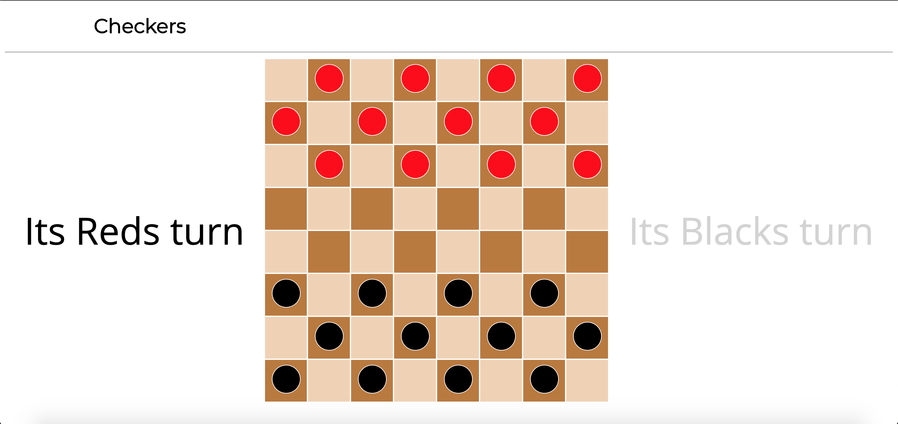

# Checkers
Checkers browser game for player vs. player

This was written using:
 1. HTML
 2. CSS
 3. JavaScript

 Future improvments:
  1. Double jumps
  2. Find ways to shorten code
  3. Make wins more extravagant
  4. Create a reset button if you want to play again (instead of refreshing)
  5. Create a player vs. CPU mode

[Click here if you would like to play the game](https://ryanbranco.github.io/Checkers/)

Screenshots:

