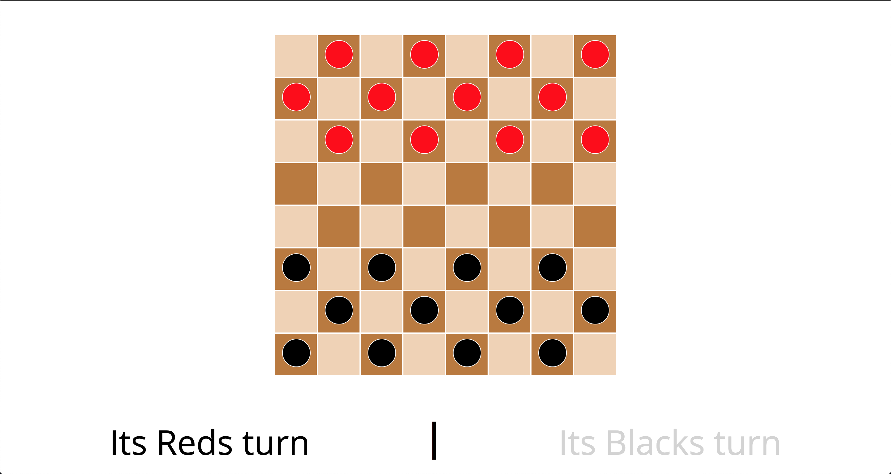
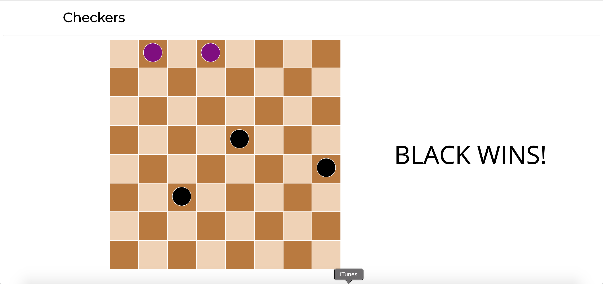

# Checkers
Checkers browser game for player vs. player

* This was written using:
  * HTML
  * CSS
  * JavaScript

* Future improvments:
  * Double jumps
  * Make wins more extravagant
  * Create a reset button if you want to play again (instead of refreshing)
  * Create a player vs. CPU mode

[Click here if you would like to play the game](https://ryanbranco.github.io/Checkers/)

Screenshots:

